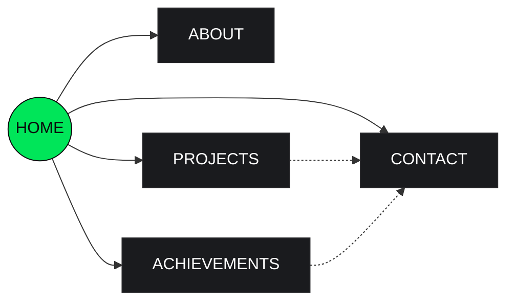
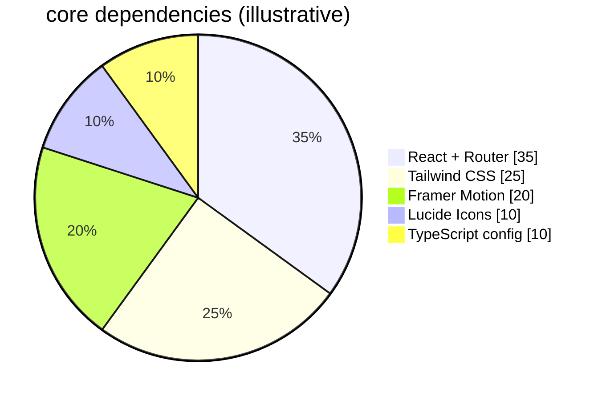

<div align="center">


<br/>


<h1>PRITAM_BISWAS<span style="color:#00E559">_</span></h1>
<p><code>CSE_CONSOLE // PORTFOLIO_v1.0.4</code></p>

<a href="https://pritam-biswas-portfolio.netlify.app/"><b>→ LIVE_DEMO</b></a>
&nbsp;·&nbsp;
<a href="#getting-started"><b>RUN_LOCALLY</b></a>
&nbsp;·&nbsp;
<a href="#connect"><b>CONNECT</b></a>

</div>

<br/>

## `> overview`

A dark, minimal, terminal-inspired portfolio console — built as a node-based interface rather than a scrolling landing page. Every section (Home, About, Projects, Achievements, Contact) is a "module" you jump into from a persistent system sidebar, styled like an engineering dashboard: monospace labels, live status dots, animated skill meters, and a rotating typing tagline.

No templated hero banners, no stock gradients — just a black-and-green console built around one idea: **treat a portfolio like a running system, not a brochure.**

<br/>

<!--
  📸 ADD PREVIEW HERE
  Drop a screen recording or screenshot at: docs/preview.gif
  then uncomment the line below.
  <div align="center"></div>
-->

<br/>

## `> features`

- **System-console navigation** — persistent sidebar + floating dock, active module highlighted in signal green
- **Typing identity line** — rotating role tagline (`App Developer` → `AI Explorer` → `Cyber Security Learner` ...) with a live blinking cursor
- **Animated skill meters** — proficiency bars that fill on module entry, not on page load
- **Console gallery** — multi-portrait slideshow styled as a tracked camera feed (`TRACKING_OK` / frame labels)
- **Live project modules** — expandable cards for each build, tagged by stack
- **Achievements board** — certificate/recognition grid with authority tags
- **One-click contact** — copy-to-clipboard email, direct links to GitHub, LeetCode, Codeforces, Facebook, Instagram
- **Fully responsive** — sidebar collapses to a mobile drawer, grid reflows down to a single column

<br/>

## `> stack`

| Layer | Choice |
|---|---|
| Framework | React 19 + Vite 6 |
| Language | TypeScript |
| Styling | Tailwind CSS 4 |
| Motion | Framer Motion (`motion`) |
| Routing | React Router 7 |
| Icons | Lucide React |
| Fonts | Inter (UI) · JetBrains Mono (system/labels) |
| Deploy | Netlify |

<br/>

## `> design tokens`

<div align="center">

| Token | Value | |
|---|---|---|
| `background` | `#09090B` | ⬛ |
| `surface` | `#1A1B1E` | ◼ |
| `primary` | `#00E559` | 🟩 |
| `accent` | `#38BDF8` | 🟦 |
| `text-primary` | `#FFFFFF` | ⬜ |
| `text-secondary` | `#A1A1AA` | ◻ |
| `border` | `#27272A` | ▪ |

Radius: `20px` cards/controls · `9999px` pills — spacing base `8px`

</div>

<br/>

## `> module map`

Site structure mirrors the actual sidebar — Home is the hub every other module branches from:



<br/>

## `> stack composition`



<br/>

## `> getting started`

**Prerequisites:** Node.js ≥ 18

```bash
# clone
git clone https://github.com/pbs002-s/pritam-biswas-portfolio.git
cd pritam-biswas-portfolio

# install
npm install

# run dev server
npm run dev

# production build
npm run build
npm run preview
```

<br/>

## `> project structure`

```
├── src/
│   ├── assets/images/       portrait & media assets
│   ├── components/
│   │   ├── Navigation.tsx   sidebar + mobile drawer
│   │   └── TerminalPanel.tsx
│   ├── pages/
│   │   └── Home.tsx
│   ├── data.ts               all real content — identity, projects, achievements
│   ├── types.ts
│   ├── App.tsx
│   └── main.tsx
├── index.html
├── vite.config.ts
└── netlify.toml
```

<br/>

## `> connect`
<a id="connect"></a>

<p align="center">
<a href="mailto:pritam020s2@gmail.com"></a>
<a href="https://github.com/pbs002-s"></a>
<a href="https://leetcode.com/u/Pritam_002"></a>
<a href="https://codeforces.com/profile/Pritam-580"></a>
</p>

<p align="center">
<a href="https://www.facebook.com/pbs.020"></a>
<a href="https://www.instagram.com/swagoto_pritom"></a>
</p>

<br/>

<div align="center">


<br/><br/>


</div>
